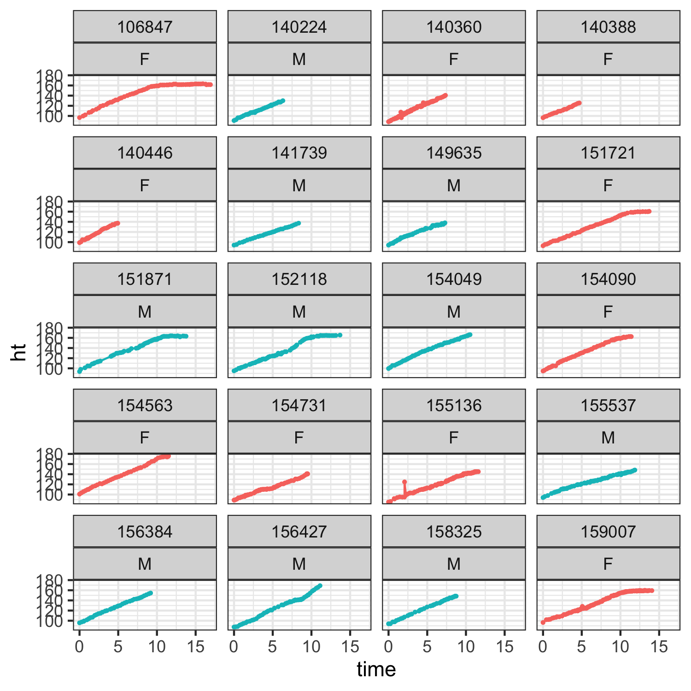

```{r setup, include=FALSE}
knitr::opts_chunk$set(echo = TRUE)
```

# Introduction

The motivation for applying the broken stick model was to facilitate the statistical analysis and testing of critical ages in the onset of childhood development with extensions to multiple imputation (van Buuren 2018b).

The broken stick model fits in the latter tradition, and features an intuitive parametrisation of each individual growth curves by a series of connected straight lines.

# Methods Study population

### General descriptions:

(why it is reasonable and useful)

-   **what type of study**: The EPIC Observational Study is a prospective, multicenter, observational longitudinal study

-   **multiple center**: The data was collected through the Cystic Fibrosis Foundation Patient Registry (CFFPR)

-   **already in use**: The design of the EPIC study has been previously reported [28,29]. Including 59 centers

-   **exclusive informations**: Include demographic and risk factor data, respiratory cultures, clinical encounter information, and clinical outcomes, such as bacterial infections or pulmonary exacerbations

-   **what is the goal**:

-   **our goal**:

### Subjects

[](Supplementary%20Table%201)

-   **check for time!!**: 1772 participants enrolled between *2004 and 2006*. The data cut-off for the current analysis was *December 2013*.

-   The enrolled children with a confirmed diagnosis of CF before the age of 12 without exposure of *Pseudomonas aeruginosa*

-   Based on either never infected or culture negative for at least 2 years); with respiratory cultures negative for *Pseudomonas aeruginosa*

-   Either no prior isolation of Pseudomonas aeruginosa, or at least a two-year period with no isolation of P. aeruginosa (Treggiari et al., 2009).

-   The beginning of follow-up was defined as an individual's earliest registry entry or pulmonary exacerbation

-   a registry entry could have occurred before their enrollment in the EPIC Observational Study

-   End of follow-up in the study was defined as a patient's latest CF registry encounter or pulmonary exacerbation.

-   **sample size**: Of the **1772** children enrolled, **76497** visit observations in the EPIC OBS study

-   we identified **1325** individuals with usable data

-   1325 for the final data analysis

-   **how many** missing or lost to-follow-up with time-varying covariates and outcomes

-   **%** had one survey record, **%** had a second, and **%** had a third, and the remaining **%** had **#th** surveys.

-   Total of **\# obs** in **\# subject** individuals were identified after eliminating registration age over 5

-   Total of **\# obs** in **\# subject** individuals were identified after eliminating follow up time less than 5 years

-   Total of **\# obs** in **\# subject** individuals were identified after eliminating avaiable visit times less than 10

-   **testing/training**: randomly

### Table1 Information

-   half of the cohort was female (49%)

-   most were Caucasian (95%)

-   Our genotype of interest was defined by the number of confirmed $\Delta F508$ (`F508del`) mutations (`0`: without mutation, `1`: with one allele mutated, or `2`: with both alells mutated), where `0` included both those with both alleles missing or those with unknown status with respect to this mutation.

-   Homozygosity of $\Delta F508$ ($\Delta F508/\Delta F508$)

-   the most common CF-causing mutation (Cystic Fibrosis Foundation, 2016) is associated with increased risk of infection and lower lung function in CF (Rosenfeld et al., 2012, Sanders et al., 2010).

-   the majority were F508del homozygous (**%**),

-   the median weight percentile at enrollment was 36.7 **(IQR: )**.

-   The median age at enrollment was 5.8 **(IQR: )** years

-   median length of follow-up 7.8 **(IQR:)** years

### Tools

the **brokenstick v 2.0.0** package. The package contains tools to fit the broken stick model to data, export the fitted model's parameters, create imputed values of the model, and predict broken stick estimates for new data.

## brokenstick model

Substantive researchers often favour repeated measures over the use of linear mixed models because of their simplicity.

For example, we can easily fit a subject-level model to predict future outcomes conditional on earlier data with repeated measures data.

While such simple regression models may be less efficient than modelling the complete data (Diggle, Heagerty, Liang, and Zeger 2002, Sec. 6.1),

The broken stick model requires a specification of a sensible set of time points at which the measurements ideally should have been taken.

-   For each subject, the model predicts or imputes hypothetical observations at those times

-   so the substantive analysis applies to the repeated measures instead of the irregular data.

applications for brokenstick model:

-   to approximate individual trajectories by a series of connected straight lines; • to align irregularly observed curves to a joint age grid;
-   to impute realisations of individual trajectories;
-   to estimate the time-to-time correlation matrix;
-   to predict future observations.

provide the examples:

-   the points are close to the scheduled ages (indicated by vertical lines), especially in the first half-year.

-   bservation times vary more for older children.

-   several children have one or more missing visits.

-   some children had fairly close visits and vary periodically

-   special cases of dropped out after certain time

## people-like-me methods

Assumptions:

-   The trajectory between break ages follows a strict linear functin. This assumption may fail for processes that are convex or concave in time. For example, human height growth in centimeters growth is concave, so setting breakpoints far apart results introduces systematic model bias. Modeling height SDS instead of raw height will prevent this bias.

-   The broken stick estimates follow a joint multivariate normal distribution. As this assumption may fail for skewed measurements, it could be beneficial to transform the outcomes so that their distribution will be closer to normal.

-   The data are Missing at Random (MAR) given the outcomes from all subjects at all observation times. This assumption is restrictive in the sense that missingness may only depend on the observed outcomes, and not on covariates other than time.

At the same time, the assumption is liberal in the sense that the missingness may depend on future outcomes. While this MAR-future assumption is unusual in the literature on drop-out and observation time models, it is a sensible strategy for creating imputations that preserve relations over time, especially for intermittent missing data. Of course, the subsequent substantive analysis on the imputed data needs to be aware of the causal direction of time.

### KR fucntion???

The brokenstick package provides another alternative, the Kasim- Raudenbush (KR) sampler (Kasim and Raudenbush 1998). The method simulates draws from the posterior distributions of parameters from a two-level normal model with heterogeneous within-subject variances. The speed of the Kasim-Raudenbush sampler is almost insensitive to the number of random effects and depends primarily on the total number of iterations and somewhat on sample size.

# Discussion

# Reference

# Supplementary

[](Table%201)

including the abacus plot to visualise this variation.



